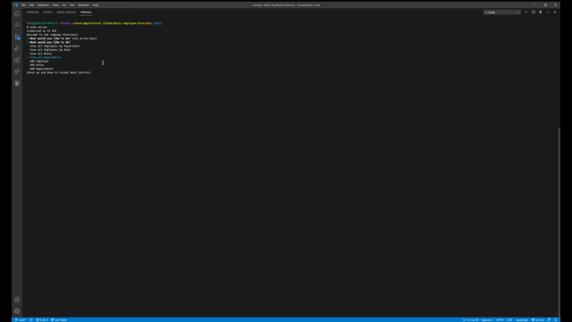

# Basic-Employee-Directory

## Project Title; Basic directory

## Description of the App: 
To use the app please run "npm i" and the required packages are going to install. Also set up a database using the seed schema and seeds to populate the database or create inputs yourself. Lastly input your password for workbench or else it will not run. The purpose of this app is to run and operate a directory for users to add and view employees, departments and roles. Everything is managed and tracked from the database and an automated ID system.

## Demo

## Code Style; HTML, CSS and Javascript/Node.js

## Credit- 
To the Columbia bootcamp team. Editor Nick Dyke 

## License- MIT license
Permission is hereby granted, free of charge, to any person obtaining a copy of this software and associated documentation files (the "Software"), to deal in the Software without restriction, including without limitation the rights to use, copy, modify, merge, publish, distribute, sublicense, and/or sell copies of the Software, and to permit persons to whom the Software is furnished to do so, subject to the following conditions:

The above copyright notice and this permission notice shall be included in all copies or substantial portions of the Software.

THE SOFTWARE IS PROVIDED "AS IS", WITHOUT WARRANTY OF ANY KIND, EXPRESS OR IMPLIED, INCLUDING BUT NOT LIMITED TO THE WARRANTIES OF MERCHANTABILITY, FITNESS FOR A PARTICULAR PURPOSE AND NONINFRINGEMENT. IN NO EVENT SHALL THE AUTHORS OR COPYRIGHT HOLDERS BE LIABLE FOR ANY CLAIM, DAMAGES OR OTHER LIABILITY, WHETHER IN AN ACTION OF CONTRACT, TORT OR OTHERWISE, ARISING FROM, OUT OF OR IN CONNECTION WITH THE SOFTWARE OR THE USE OR OTHER DEALINGS IN THE SOFTWARE.

